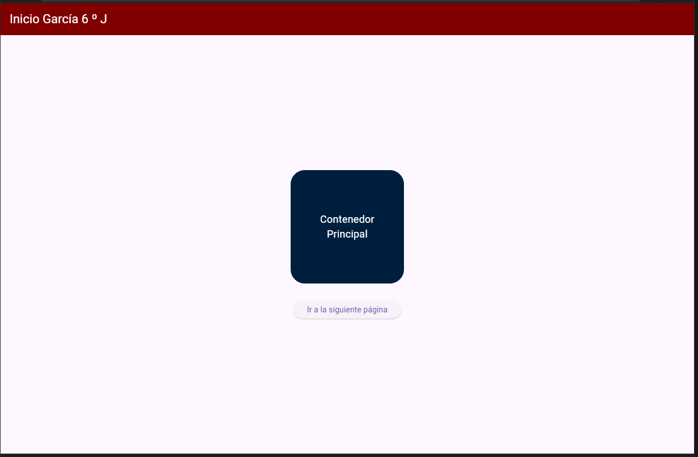
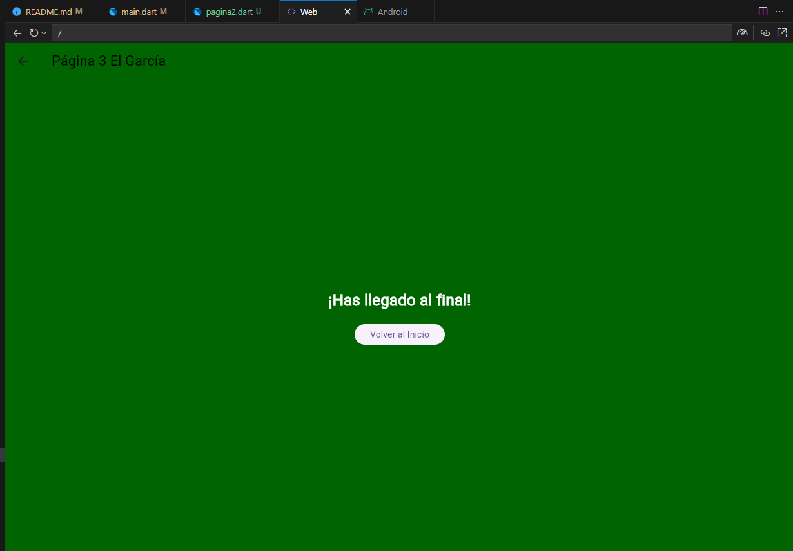
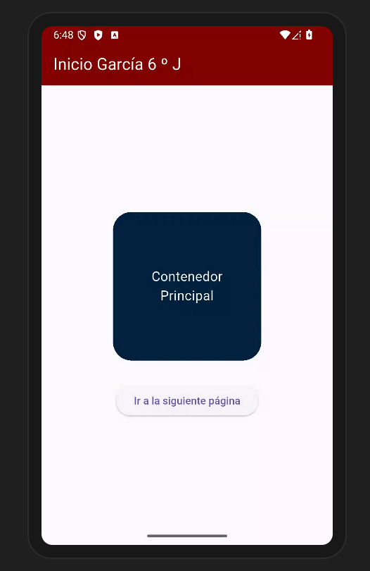

# Navegación entre tres páginas
# Eliseo García Gpo 6J
# Mi prompt o pregunta a la AI original

Lenguaje Dart Flutter. Nivel principiante. Navegación entre tres páginas utilizando rutas nombradas, desde main llamar a la página1, en la página1 en appbar el texto "Inicio García 6 º J" en color blanco, color de fondo guinda, iconos blancos, en body, un contenedor redondeado color azul oscuro de 200 x 200 con texto blanco, centrado y un botón de color amarillo texto negro para seleccionar página2, en la página2 un appbar con texto "Segunda página 6 º J" rojo fondo negro y los iconos blancos, en body una imagen desde la red y un botón para avanzar a la página3. en la página3 en appbar un texto con texto negro "Página 3 El García", color de fondo verde oscuro, texto blanco. Todo en un solo archivo, elegante y atractivo.

## Pantallas Web

## Pantallas en android

